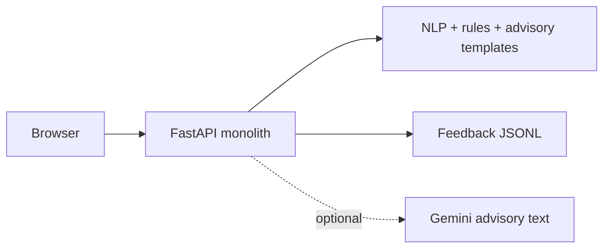
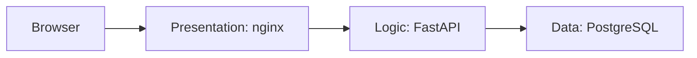
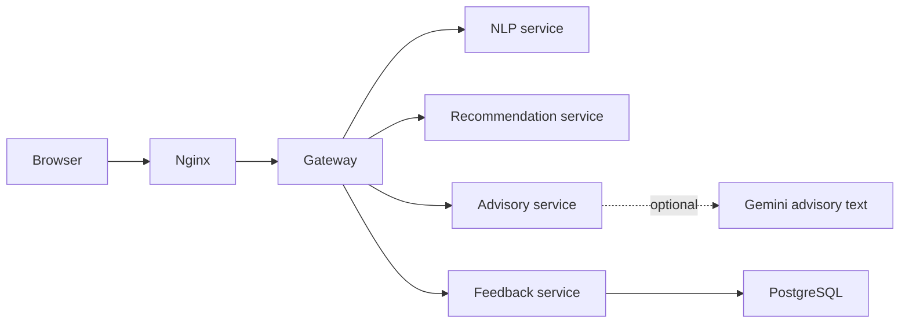

# Architecture comparison

These diagrams describe the same unchanged frontend and API contract implemented
in three deployment styles. Sensor and weather values are simulated demo data.
Advisory responses identify their source as either `gemini` or the local
`template` fallback.

## Monolith

## Three-tier

## Microservices

| Area | Monolith | Three-tier | Microservices |
|---|---|---|---|
| Deployment | One application image | Three logical tiers | Several independently deployable services |
| Scaling | Scale the whole application | Scale logic and data separately | Scale one busy service at a time |
| Failure isolation | Low | Database and web tiers are separated | Downstream failure can be degraded instead of an error page |
| Data ownership | JSONL file | Logic writes PostgreSQL | Feedback service owns PostgreSQL access |
| Complexity | Lowest | Medium | Highest; networking and observability are required |

Gemini is optional. The recommendation remains rule-based, and the local
template is used when Gemini is not configured or unavailable.
